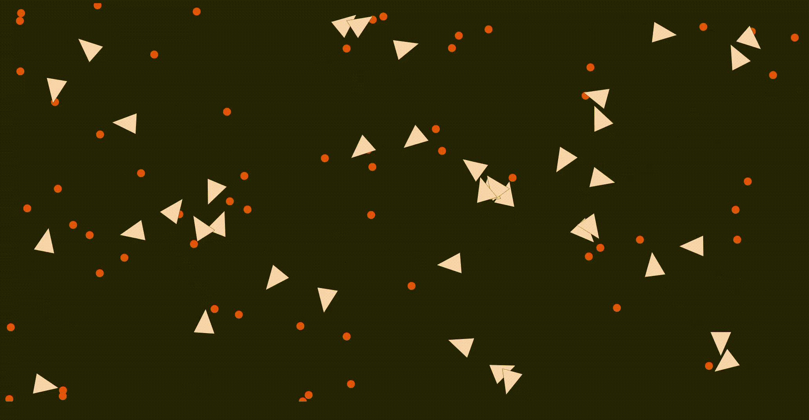

# 🪶 Blackbird

A simulation of birds acquiring food across generations, enabled by neural networks and genetic algorithms:



The intent of this project was to learn about the Rust programming language, the fundamentals of neural networks, and 
the concept of genetic algorithms. [Learning to Fly](https://pwy.io/en/posts/learning-to-fly-pt1), 
a tutorial created by Patryk Wychowaniec, details how this project was made.

In short, I implemented a neural network that predicts how a bird should rotate and how fast it should travel to
get food. Then, I programmed genetic algorithms that maximize the amount of food birds gather. I combined the 
neural network and genetic algorithms to simulate and train the birds across multiple generations. Lastly,
I created web assembly bindings for the simulation so that it could be rendered in a web browser. 

To garner a bit more hands-on experience, I implemented rank selection, k-point crossover, 
unit tests for both methods, and altered the overall style of the web page. Rank selection makes it so the neural
network avoids prematurely selecting one bird as the most fit bird for multiple generations. 
K-point crossover ensures that future birds retain similarities to their parents, without entirely duplicating how their parents behaved.
Overall, it takes longer than the original implementation to converge, but it introduces more unique birds to the population.  

# Prerequisites
Before attempting to build the project, please install [Rust](https://www.rust-lang.org/tools/install), [npm](https://docs.npmjs.com/downloading-and-installing-node-js-and-npm), and [wasm-pack](https://rustwasm.github.io/wasm-pack/installer/).

# Building

```bash
# 1/3: Clone the repository
$ git clone https://github.com/rgabrielbrito/blackbird
$ cd blackbird

# 2/3: Compile Rust into WebAssembly
$ cd libs/simulation-wasm
$ wasm-pack build --release

# 3/3: Start the front end application
$ cd ../../js
$ npm install
$ npm run start

# Open `http://localhost:8080` in your browser once npm run start is done
```

# Usage

Once the application is running, the Blackbird web page has a button to train the population. Each time the button is pressed, the program logs simple stats regarding how the population changed from one generation to the next. These stats are visible through the browser's developer console.

# License

Copyright (c) 2020-2022, Patryk Wychowaniec <pwychowaniec@pm.me>.    
Licensed under the MIT license.

# References
[Tutorial](https://pwy.io/en/posts/learning-to-fly-pt1) \
[Rank Selection](https://stackoverflow.com/questions/13659815/ranking-selection-in-genetic-algorithm-code) \
[K-Point Crossover](https://www.sciencedirect.com/topics/computer-science/point-crossover)
