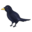

#  Blackbird

Simulation of evolution, powered by neural networks, genetic algorithms & high-school math:


Feeling curious? I've described the implementation above on my blog: [Learning to Fly](https://pwy.io/en/posts/learning-to-fly-pt1).

# Building

## Using Cargo and npm

```bash
# 1/3: Clone the repository
$ git clone https://github.com/patryk27/shorelark
$ cd shorelark

# 2/3: Compile Rust into WebAssembly
$ cd libs/simulation-wasm
$ wasm-pack build --release

# 3/3: Start the frontend application
$ cd ../../js
$ npm install
$ npm run start

# ^ After launching this, open `http://localhost:8080` in your web browser
```

# Usage

Shorelark contains a simple in-game introduction - just read what the terminal on the left side says and have fun!

# License

Copyright (c) 2020-2022, Patryk Wychowaniec <pwychowaniec@pm.me>.    
Licensed under the MIT license.
