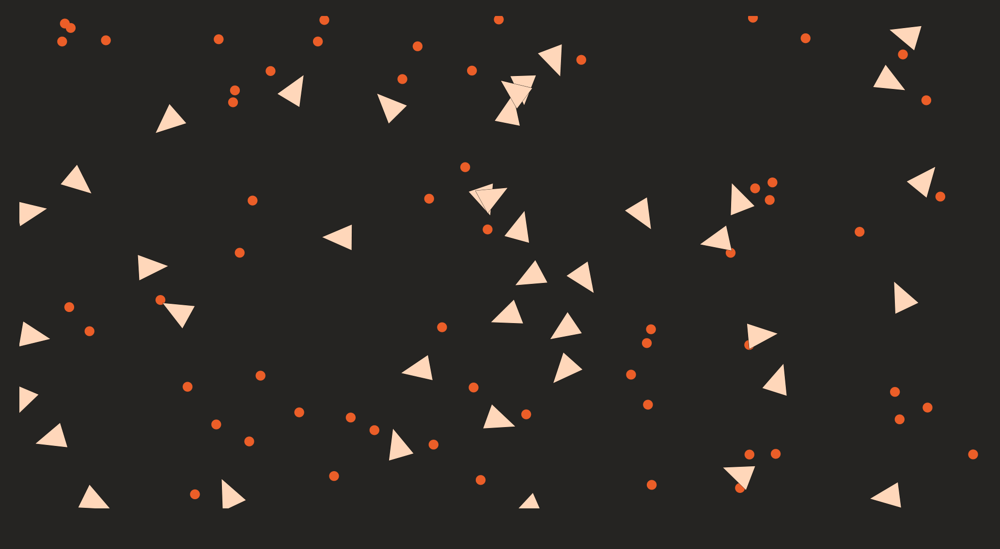

# 🪶 Blackbird

A simulation of birds acquiring food across generations, enabled by neural networks and genetic algorithms:



The intent of this project was to learn about idiomatic Rust, the fundamentals of neural networks, and the concept of genetic algorithms. [Learning to Fly](https://pwy.io/en/posts/learning-to-fly-pt1), a tutorial created by Patryk Wychowaniec, details how this project was made.

To garner a bit more hands-on experience than the tutorial, I implemented Rank Selection, K-Point Crossover, unit tests for both methods, and altered the overall style of the web page.  

I described implementation details in the READMEs for each crate in libs/.

# Building

```bash
# 1/3: Clone the repository
$ git clone https://github.com/rgabrielbrito/blackbird
$ cd blackbird

# 2/3: Compile Rust into WebAssembly
$ cd libs/simulation-wasm
$ wasm-pack build --release

# 3/3: Start the front end application
$ cd ../../js
$ npm install
$ npm run start

# Open `http://localhost:8080` in your browser once npm run start is done
```

# Usage

Once the application is running, the Blackbird web page has a button to train the population. Each time the button is pressed, the program logs simple stats regarding how the population changed from one generation to the next. These stats are visible through the browser's developer console.

# License

Copyright (c) 2020-2022, Patryk Wychowaniec <pwychowaniec@pm.me>.    
Licensed under the MIT license.

# References
[Tutorial](https://pwy.io/en/posts/learning-to-fly-pt1) \
[Rank Selection](https://stackoverflow.com/questions/13659815/ranking-selection-in-genetic-algorithm-code) \
[K-Point Crossover](https://www.sciencedirect.com/topics/computer-science/point-crossover)
